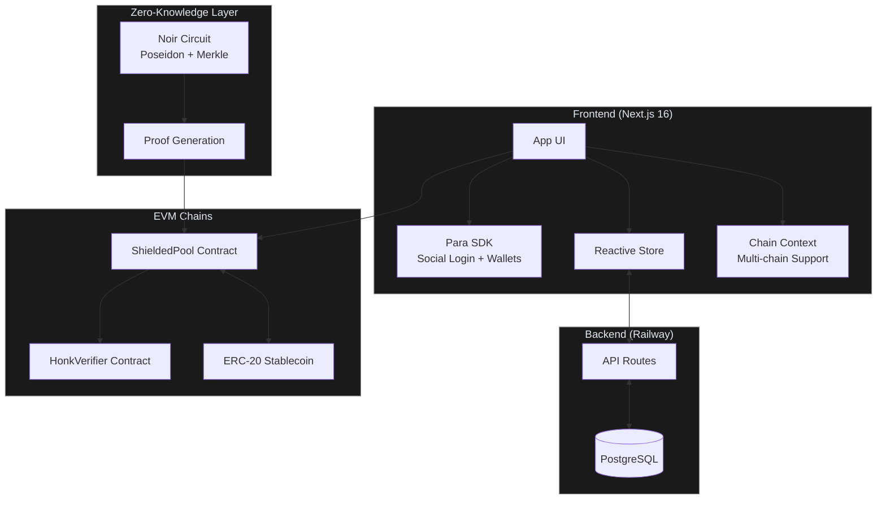
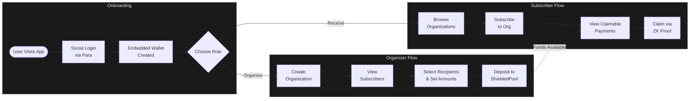
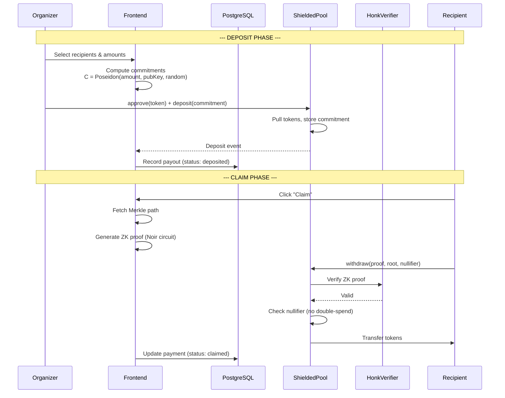
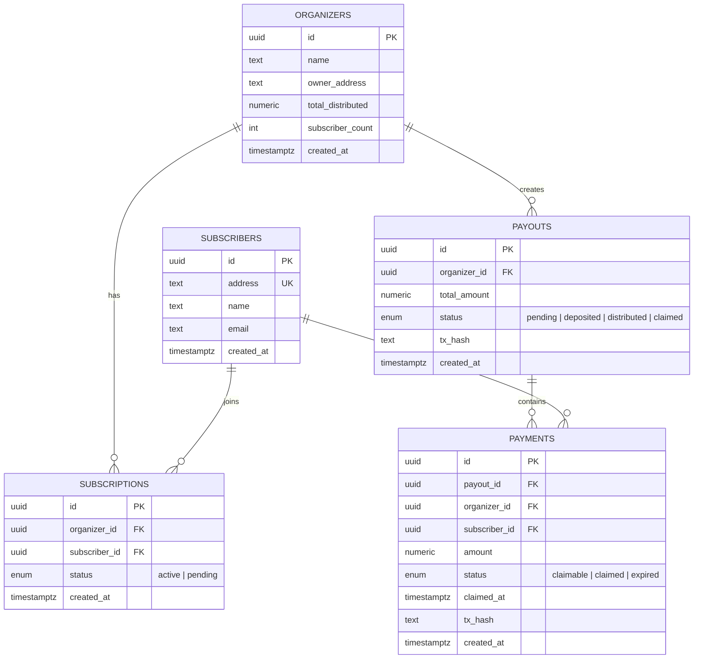

# Blizkperse

**Private stablecoin payments on any chain.**

Blizkperse is a chain-agnostic payout platform that uses Zero-Knowledge proofs to make on-chain payments confidential. Organizers deposit tokens into a shielded pool; recipients claim them with ZK proofs so payment amounts stay hidden on-chain.

## How it works

1.  **Recipients** login via **Social Login** (Para) and instantly get an Embedded Wallet.
2.  **Recipients** "Subscribe" to a Payer (Organizer/DAO).
3.  **Payers** select subscribers, input amounts of **any stablecoin**, and execute a **Bulk Payout** into a Shielded Pool.
4.  **Recipients** claim funds using a **Zero-Knowledge Proof** — no link between sender and receiver.
5.  **Agents**: API-ready for AI Agents and **x402** to trigger payouts autonomously.

## Architecture

## Supported Chains

| Chain | ID | Status | Stablecoin | Explorer |
|---|---|---|---|---|
| **Monad** | 143 | Live | USDC | [monadexplorer.com](https://monadexplorer.com) |
| **Celo** | 42220 | Planned | cUSD | [celoscan.io](https://celoscan.io) |

### Deployed Contracts (Monad Mainnet)

| Contract | Address |
|---|---|
| **HonkVerifier** | `0xf7b2eC9EC33e34431F7f184458aE18Fa418271E3` |
| **WithdrawVerifier** | `0xA465f96F9a0541D7392c5A22bBA7bc5f23e88f7c` |
| **ShieldedPool** | `0x085BD9c0C568BE5093130E2359B00e46cb0800d1` |
| **USDC** | `0x754704Bc059F8C67012fEd69BC8A327a5aafb603` |

- **RPC**: `https://rpc3.monad.xyz`
- **Deployer**: `0xc696DDc31486D5d8b87254d3AA2985F6d0906b3a`
- **Block**: `0x35811d2` (56,234,450)
- **Deployment artifact**: [`zk/deployments/monad-mainnet/run-latest.json`](zk/deployments/monad-mainnet/run-latest.json)

## User Flow

## ZK Payment Flow

## Database Schema

## Tech Stack

-   **Chains**: Monad (143), Celo (42220) — any EVM chain supported
-   **Contracts**: Foundry (Solidity) + Noir ZK Circuits
-   **Frontend**: Next.js 16 (App Router, Webpack) + Tailwind CSS v4
-   **Auth**: Para SDK (Social Login + Embedded Wallets)
-   **Infrastructure**: Railway (PostgreSQL + Next.js Hosting)
-   **Payments**: Any ERC-20 stablecoin (defaults to USDC)
-   **Theming**: Chain-adaptive — neutral default, colors activate per selected chain

## Documentation

### Architecture & Integration
| Doc | Description |
|---|---|
| [Technical Spec](docs/technical_spec.md) | Full architecture, ZK flows, DB schema, deployment |
| [Integration Guide](docs/integration_guide.md) | Frontend <-> ZK <-> Contract wiring, proof generation |

### ZK Circuits & Contracts
| Doc | Description |
|---|---|
| [Circuits README](zk/README.md) | Noir + Foundry setup, verifier generation |
| [Deposit/Withdraw Demo](zk/docs/DEMO_DEPOSIT_WITHDRAW.md) | Step-by-step demo: compile, deploy, deposit, withdraw |
| [Deposit/Withdraw Testing](zk/docs/TEST_DEPOSIT_WITHDRAW.md) | On-chain validation and anonymity verification |

### Pitch & Brand
| Doc | Description |
|---|---|
| [Pitch Deck](docs/pitch_deck.md) | Pitch narrative, GTM strategy, vision |
| [Pitch Slides](docs/pitch_slides.md) | Slide structure with speaker notes |
| [Brand Kit](docs/brand_kit.md) | Color palette, typography, design rules |

## Getting Started (Local)

### Prerequisites
-   Node.js 18+
-   Foundry (`forge`)
-   npm
-   PostgreSQL (local or Railway dev DB)

### Installation

1.  Clone repo
2.  `cd web && npm install`
3.  `cd zk && forge install`
4.  Copy `web/.env.example` -> `web/.env.local` and fill in `DATABASE_URL`
5.  Run `psql $DATABASE_URL < sql/schema.sql` to set up tables
6.  `cd web && npm run dev -- --webpack`

## Deploy to Railway

1.  **Create project** — [railway.app](https://railway.app) -> New Project -> Deploy from GitHub
2.  **Add PostgreSQL** — Click "New" -> "Database" -> "PostgreSQL"
3.  **Link the DB** — Railway auto-injects `DATABASE_URL` into your app service
4.  **Run schema** — Connect to the DB (Railway -> Data tab -> Query) and paste [sql/schema.sql](sql/schema.sql)
5.  **Set env vars** — Add `NEXT_PUBLIC_PARA_API_KEY` in the app service variables
6.  **Deploy** — Push to GitHub; Railway builds and deploys automatically
