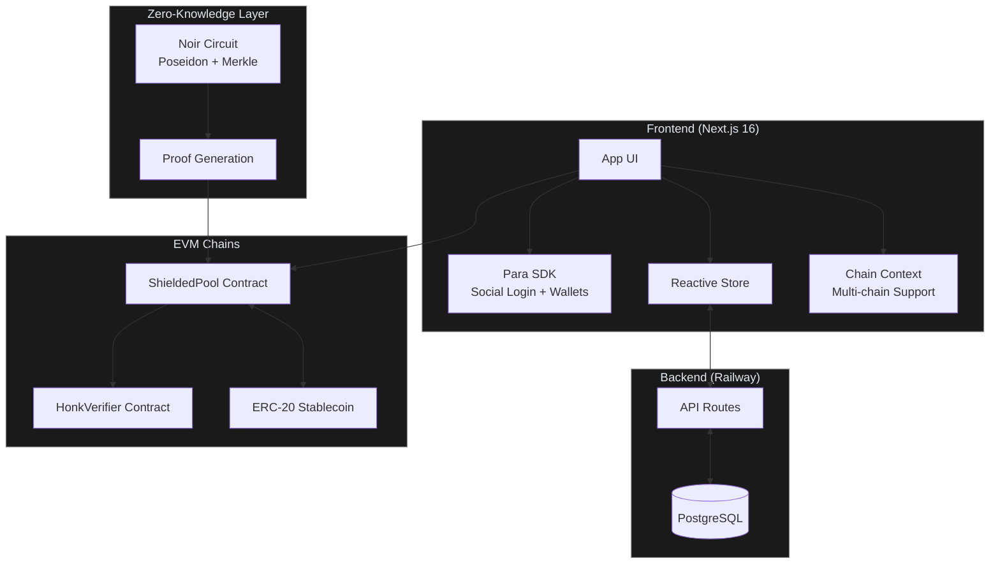

# Blizkperse

**Private stablecoin payments on any chain.**

Blizkperse is a chain-agnostic payout platform that uses Zero-Knowledge proofs to make on-chain payments confidential. Organizers deposit tokens into a shielded pool; recipients claim them with ZK proofs so payment amounts stay hidden on-chain.

---

## How It Works

1. **Login**: Recipients sign in via Social Login (Para) and instantly get an Embedded Wallet.
2. **Subscribe**: Recipients subscribe to a Payer (Organizer/DAO).
3. **Deposit**: Payers select subscribers, set amounts of any stablecoin, and execute a Bulk Payout into a Shielded Pool.
4. **Claim**: Recipients claim funds using a Zero-Knowledge Proof with no link between sender and receiver.
5. **Agents**: API-ready for AI Agents and x402 to trigger payouts autonomously.

---

## Architecture



---

## Supported Chains

| Chain | ID | Status | Pool | USDC | Explorer |
| --- | --- | --- | --- | --- | --- |
| **Monad** | 143 | Live | [`0x8d44…343c`](https://monadexplorer.com/address/0x8d44379c778Cb714B72FcaD80dcb5EC7c031343c) | [`0x7547…F603`](https://monadexplorer.com/address/0x754704Bc059F8C67012fEd69BC8A327a5aafb603) | [monadexplorer.com](https://monadexplorer.com) |
| **Celo** | 42220 | Live | [`0xcE61…B16A`](https://celoscan.io/address/0xcE61001eb3Cd531784D2Cee9DDAbB17a3fc6B16A) | [`0xcebA…18C`](https://celoscan.io/address/0xcebA9300f2b948710d2653dD7B07f33A8B32118C) | [celoscan.io](https://celoscan.io) |

> Full contract addresses and verifier details in the [Technical Spec](docs/technical_spec.md#4-smart-contracts) and [ZK README](zk/README.md#deployed-contracts).

---

## Tech Stack

| Layer | Technology |
| --- | --- |
| **Blockchain** | Any EVM chain, currently Monad (143) and Celo (42220) |
| **Contracts** | Foundry (Solidity) + Noir ZK Circuits |
| **Frontend** | Next.js 16 (App Router, Webpack) + Tailwind CSS v4 |
| **Auth** | Para SDK for Social Login + Embedded Wallets |
| **UI** | shadcn/ui (new-york style, Radix primitives) |
| **Database** | PostgreSQL (Railway) |
| **Payments** | Any ERC-20 stablecoin (defaults to USDC) |
| **Theming** | Chain-adaptive, neutral default, colors activate per chain |

---

## Project Structure

```text
blizkperse/
├── web/                    # Next.js frontend
│   ├── app/                # App Router pages (landing, payer, receive)
│   ├── components/         # Header, auth guard, chain selector, UI
│   ├── lib/                # Constants, contracts, merkle, ZK, store, DB
│   └── public/circuits/    # Compiled circuit artifact (circuit.json)
├── zk/                     # ZK circuits + Solidity contracts
│   ├── circuits/           # Noir circuits (main.nr, withdraw.nr) + scripts
│   ├── contract/           # Generated verifier contracts
│   ├── src/                # ShieldedPool.sol
│   ├── script/             # Foundry deploy scripts
│   └── docs/               # Build, deploy, and testing guides
├── sql/                    # Database schema
└── docs/                   # Architecture, integration, pitch, brand
```

---

## Getting Started

### Prerequisites

- Node.js 20+
- [Foundry](https://book.getfoundry.sh) (`forge`, `cast`, `anvil`)
- [Nargo](https://noir-lang.org/docs/getting_started/noir_installation) (Noir compiler)
- [Barretenberg](https://github.com/AztecProtocol/aztec-packages/tree/master/barretenberg/bbup) (`bb` CLI)
- PostgreSQL (local or Railway)

### Quick Start

```bash
# 1. Clone and install frontend
cd web && npm install

# 2. Install contract dependencies
cd ../zk && forge install

# 3. Configure environment
cp ../web/.env.example ../web/.env.local
# Fill in NEXT_PUBLIC_PARA_API_KEY and DATABASE_URL

# 4. Start dev server (--webpack required for WASM compatibility)
cd ../web && npm run dev -- --webpack
```

Open [http://localhost:3000](http://localhost:3000).

### Deploy to Railway

1. **Create project**: [railway.app](https://railway.app) > New Project > Deploy from GitHub
2. **Add PostgreSQL**: Click "New" > "Database" > "PostgreSQL"
3. **Set env vars**: Add `NEXT_PUBLIC_PARA_API_KEY` (Railway auto-injects `DATABASE_URL`)
4. **Deploy**: Push to GitHub; Railway builds and deploys automatically

---

## Documentation

Every doc in the project, organized by area.

### Architecture & Frontend

| File | Description |
| --- | --- |
| [`docs/technical_spec.md`](docs/technical_spec.md) | Full architecture, contract interfaces, DB schema, deployment |
| [`docs/integration_guide.md`](docs/integration_guide.md) | Frontend <-> ZK <-> Contract wiring, proof generation flow |
| [`web/README.md`](web/README.md) | Next.js app setup, env vars, project structure, Railway deploy |
| [`sql/schema.sql`](sql/schema.sql) | PostgreSQL database schema (tables, RLS policies) |

### ZK Circuits & Contracts

| File | Description |
| --- | --- |
| [`zk/README.md`](zk/README.md) | Noir + Foundry setup, verifier generation, deployed contract addresses |
| [`zk/docs/BUILD_AND_DEPLOY.md`](zk/docs/BUILD_AND_DEPLOY.md) | Verifier compilation, deployment checklist, avoiding SumcheckFailed |
| [`zk/docs/DEMO_DEPOSIT_WITHDRAW.md`](zk/docs/DEMO_DEPOSIT_WITHDRAW.md) | Step-by-step CLI demo: compile, deploy, deposit, withdraw |
| [`zk/docs/TEST_DEPOSIT_WITHDRAW.md`](zk/docs/TEST_DEPOSIT_WITHDRAW.md) | On-chain anonymity validation, proof generation, testing guide |

### Brand & Pitch

| File | Description |
| --- | --- |
| [`docs/brand_kit.md`](docs/brand_kit.md) | Color palette (oklch), typography, chain-adaptive theming rules |

### Hackathon

| File | Description |
| --- | --- |
| [`docs/hackathon/`](docs/hackathon/) | Pitch deck, slides, submission form, HTML presentations |

---

## Team

- [**0xj4an**](https://github.com/0xj4an) - Frontend, Documentation, Product
- [**ArturVargas**](https://github.com/ArturVargas) - ZK Circuits, Contracts, Deploy Scripts
