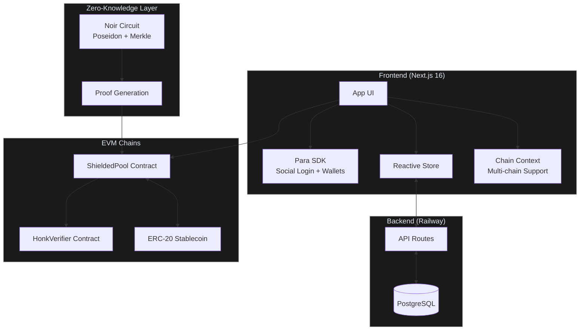

# Blizkperse

**Private stablecoin payments on any chain.**

Blizkperse is a chain-agnostic payout platform that uses Zero-Knowledge proofs to make on-chain payments confidential. Organizers deposit tokens into a shielded pool; recipients claim them with ZK proofs so payment amounts stay hidden on-chain.

---

## How It Works

1. **Login**: Recipients sign in via Social Login (Para) and instantly get an Embedded Wallet.
2. **Subscribe**: Recipients subscribe to a Payer (Organizer/DAO).
3. **Deposit**: Payers select subscribers, set amounts of any stablecoin, and execute a Bulk Payout into a Shielded Pool.
4. **Claim**: Recipients claim funds using a Zero-Knowledge Proof with no link between sender and receiver.
5. **Agents**: API-ready for AI Agents and x402 to trigger payouts autonomously.

---

## Architecture



---

## Supported Chains

### Mainnet

| Chain | ID | ShieldedPool | HonkVerifier | WithdrawVerifier | USDC |
| --- | --- | --- | --- | --- | --- |
| **Monad** | 143 | [`0x9726…0674`](https://monadexplorer.com/address/0x97268f95e49bC5C7C8711111cCFe509D76C00674) | [`0x4eE5…c393`](https://monadexplorer.com/address/0x4eE52aEb000B91853A5a6f9db9B1f969f1b0c393) | [`0x0D70…9D94`](https://monadexplorer.com/address/0x0D70d098085CeD93864B41cD0fF506C2CD329D94) | [`0x7547…F603`](https://monadexplorer.com/address/0x754704Bc059F8C67012fEd69BC8A327a5aafb603) |
| **Celo** | 42220 | [`0x1aBe…3778`](https://celoscan.io/address/0x1aBee1E0205BB4E6d0b95a2C1F5072d9f3064778) | [`0x3D76…CCb9`](https://celoscan.io/address/0x3D76FC7Ce515aB1d69A4e734354c6EC94c22CCb9) | [`0x6e47…eD95`](https://celoscan.io/address/0x6e4794166dE8Af43D1720f66bA39f561F2C0eD95) | [`0xcebA…18C`](https://celoscan.io/address/0xcebA9300f2b948710d2653dD7B07f33A8B32118C) |

### Testnet

| Chain | ID | ShieldedPool | Verifier | WithdrawVerifier | USDC |
| --- | --- | --- | --- | --- | --- |
| **Monad Testnet** | 10143 | [`0xcdc6…1db3`](https://testnet.monadvision.com/address/0xcdc6ade9d348572f302690bd39ba8120f8e91db3) | [`0x8d10…01ac`](https://testnet.monadvision.com/address/0x8d10ad45b21d4db2e7270e519a757c764c6501ac) | [`0xd9ae…1e57`](https://testnet.monadvision.com/address/0xd9aee9351f7685b05a6b7bd8c1ca509d24be1e57) | [`0x534b…d7A3`](https://testnet.monadvision.com/address/0x534b2f3A21130d7a60830c2Df862319e593943A3) |
| **Celo Testnet** | 11142220 | [`0x0388…b475`](https://celo-sepolia.blockscout.com/address/0x038803a40130734e6ab711489060ea55f05bb475) | [`0x0f86…f4a6`](https://celo-sepolia.blockscout.com/address/0x0f86796c3f3254442debd0705a56bdd82c69f4a6) | [`0xd850…054f`](https://celo-sepolia.blockscout.com/address/0xd850af48bddf6e568a994a870aa684b86bb5054f) | [`0x01C5…B44E`](https://celo-sepolia.blockscout.com/address/0x01C5C0122039549AD1493B8220cABEdD739BC44E) |

> Source of truth: [`web/lib/constants.ts`](web/lib/constants.ts). Deploy blocks and full addresses also in [ZK README](zk/README.md#deployed-contracts).

---

## Tech Stack

| Layer | Technology |
| --- | --- |
| **Blockchain** | Any EVM chain, currently Monad (143) and Celo (42220) |
| **Contracts** | Foundry (Solidity) + Noir ZK Circuits |
| **Frontend** | Next.js 16 (App Router, Webpack) + Tailwind CSS v4 |
| **Auth** | Para SDK for Social Login + Embedded Wallets |
| **UI** | shadcn/ui (new-york style, Radix primitives) |
| **Database** | PostgreSQL (Railway) |
| **Payments** | Any ERC-20 stablecoin (defaults to USDC) |
| **Theming** | Chain-adaptive, neutral default, colors activate per chain |

---

## Project Structure

```text
blizkperse/
├── docs/                           # Architecture, integration, brand docs
│   ├── technical_spec.md           # Full architecture, contracts, DB schema, deployment
│   ├── integration_guide.md        # Frontend <-> ZK <-> Contract wiring
│   └── brand_kit.md                # Color palette, typography, chain-adaptive theming
│
├── landing/                        # Marketing landing page (separate Next.js project)
│   ├── app/
│   │   ├── fonts/                  # Geist Sans + Mono (woff2)
│   │   ├── globals.css             # Neutral-only theme (no chain switching)
│   │   ├── layout.tsx              # Root layout: dark theme, Geist font
│   │   └── page.tsx                # Landing page (hero, stats, features, CTA)
│   ├── components/ui/button.tsx    # Minimal UI (button only)
│   ├── lib/utils.ts                # cn() helper
│   └── public/                     # Logo, partner images
│
├── sql/
│   └── schema.sql                  # PostgreSQL schema (6 tables + indexes + seed data)
│
├── web/                            # App frontend (Next.js + Para SDK + ZK)
│   ├── app/
│   │   ├── api/                    # API routes
│   │   │   ├── data/               # GET: fetch all store data
│   │   │   ├── deposit-events/     # GET: fetch deposit events by chain
│   │   │   ├── generate-proof/     # POST: server-side proof generation
│   │   │   ├── notes/              # POST: store ZK notes
│   │   │   ├── organizers/         # CRUD: organizer management
│   │   │   ├── payments/           # PATCH: claim payment
│   │   │   ├── payouts/            # CRUD: payout management
│   │   │   ├── subscribers/        # CRUD: subscriber management
│   │   │   └── subscriptions/      # POST: subscribe to organizer
│   │   ├── dashboard/page.tsx      # Role selector (payer vs receiver)
│   │   ├── lib/withdrawProver.ts   # Server-side withdrawal proof helper
│   │   ├── payer/
│   │   │   ├── page.tsx            # Organizer dashboard (orgs, stats, subscribers)
│   │   │   └── create/page.tsx     # Multi-step payout creation flow
│   │   ├── receive/
│   │   │   ├── [id]/page.tsx       # Claim page (ZK proof + withdrawal)
│   │   │   └── page.tsx            # Subscriber dashboard (browse orgs, payments)
│   │   ├── client-shell.tsx        # Providers + ChainProvider wrapper
│   │   ├── globals.css             # Chain-adaptive themes (neutral, Monad, Celo)
│   │   ├── layout.tsx              # Root layout: dark theme, Geist font
│   │   └── page.tsx                # Chain selector (network selection entry)
│   ├── components/
│   │   ├── ui/                     # shadcn/ui components
│   │   ├── auth-guard.tsx          # Route protection
│   │   ├── chain-selector.tsx      # Chain switcher (Monad/Celo)
│   │   ├── header.tsx              # Nav bar with chain selector + wallet
│   │   ├── page-shell.tsx          # Page layout wrapper
│   │   ├── para-wrapper.tsx        # Para SDK modal wrapper
│   │   ├── providers.tsx           # ParaProvider + QueryClient
│   │   ├── tx-status.tsx           # Transaction status with explorer link
│   │   └── wallet-display.tsx      # Wallet address display
│   ├── lib/
│   │   ├── api-auth.ts             # API route auth middleware
│   │   ├── chain-context.tsx       # ChainProvider + useChain() hook
│   │   ├── constants.ts            # Chain registry (source of truth for addresses)
│   │   ├── contracts.ts            # Viem contract interactions
│   │   ├── db.ts                   # PostgreSQL client + auto-schema
│   │   ├── merkle.ts               # Client-side Merkle tree from on-chain events
│   │   ├── server-auth.ts          # Server-side auth helpers
│   │   ├── store.ts                # Reactive store (useSyncExternalStore + PostgreSQL)
│   │   ├── utils.ts                # Shared utilities
│   │   ├── wallet.ts               # Wallet utilities
│   │   └── zk.ts                   # Noir proof generation + crypto primitives
│   └── public/circuits/circuit.json # Compiled Noir circuit artifact
│
├── zk/                             # ZK circuits + Solidity contracts (Foundry)
│   ├── circuits/
│   │   ├── src/
│   │   │   ├── main.nr             # Withdraw circuit (5 public inputs)
│   │   │   ├── pay.nr              # Transfer circuit (4 public inputs)
│   │   │   └── withdraw.nr         # Withdraw alias
│   │   └── Nargo.toml              # Noir package config (with_foundry, >=0.31.0)
│   ├── contract/
│   │   ├── ShieldedPool.sol        # Main pool: deposit, transfer, withdraw
│   │   ├── Verifier.sol            # HonkVerifier (transfer circuit)
│   │   └── WithdrawVerifier.sol    # WithdrawHonkVerifier (withdraw circuit)
│   ├── docs/
│   │   ├── build-and-deploy.md     # Verifier compilation + deployment checklist
│   │   ├── demo-deposit-withdraw.md # Step-by-step CLI demo
│   │   ├── test-deposit-withdraw.md # On-chain testing guide
│   │   └── testnet-deploy.md       # Testnet deployment guide
│   └── script/
│       ├── Deploy.s.sol            # Deploy all contracts
│       └── Verify.s.sol            # Verification script
│
├── .dockerignore                   # Docker ignore rules
├── .gitignore                      # Git ignore rules
├── .gitmodules                     # Git submodules (Foundry deps)
├── anvil.log                       # Local Foundry devnet log
├── Dockerfile                      # App deployment (web/)
├── Dockerfile.landing              # Landing page deployment (landing/)
├── fetch_proof.mjs                 # Utility: fetch proof from chain
├── railway.toml                    # Railway deployment config
├── README.md                       # This file
├── simulate_error.mjs              # Utility: simulate contract errors
└── slice_test.mjs                  # Utility: proof slice testing
```

---

## Getting Started

### Prerequisites

- Node.js 20+
- [Foundry](https://book.getfoundry.sh) (`forge`, `cast`, `anvil`)
- [Nargo](https://noir-lang.org/docs/getting_started/noir_installation) (Noir compiler)
- [Barretenberg](https://github.com/AztecProtocol/aztec-packages/tree/master/barretenberg/bbup) (`bb` CLI)
- PostgreSQL (local or Railway)

### Quick Start

```bash
# 1. Landing page (static marketing site)
cd landing && npm install && npm run dev -- -p 3002
```

Open [http://localhost:3002](http://localhost:3002).

```bash
# 2. Install contract dependencies
cd ../zk && forge install

# 3. Install app frontend
cd ../web && npm install

# 4. Configure environment
cp .env.example .env.local
# Fill in NEXT_PUBLIC_PARA_API_KEY and DATABASE_URL

# 5. Start app dev server (--webpack required for WASM compatibility)
npm run dev -- --webpack
```

Open [http://localhost:3000](http://localhost:3000).

### Deploy to Railway

**Landing** (`blizkperse.com`):

1. Create a Railway service pointing to `Dockerfile.landing`
2. Set `NEXT_PUBLIC_APP_URL=https://app.blizkperse.com`
3. **Watch path**: Set to `/landing/**`

**App** (`app.blizkperse.com`):

1. **Create project**: [railway.app](https://railway.app) > New Project > Deploy from GitHub
2. **Add PostgreSQL**: Click "New" > "Database" > "PostgreSQL"
3. **Set env vars**: Add `NEXT_PUBLIC_PARA_API_KEY` (Railway auto-injects `DATABASE_URL`)
4. **Watch path**: Set to `/web/**` to avoid rebuilds on landing changes
5. **Deploy**: Push to GitHub; Railway builds and deploys automatically

---

## Documentation

Every doc in the project, organized by area.

### Architecture & Frontend

| File | Description |
| --- | --- |
| [`docs/technical_spec.md`](docs/technical_spec.md) | Full architecture, contract interfaces, DB schema, deployment |
| [`docs/integration_guide.md`](docs/integration_guide.md) | Frontend <-> ZK <-> Contract wiring, proof generation flow |
| [`web/README.md`](web/README.md) | Next.js app setup, env vars, project structure, Railway deploy |
| [`sql/schema.sql`](sql/schema.sql) | PostgreSQL database schema (tables, RLS policies) |

### ZK Circuits & Contracts

| File | Description |
| --- | --- |
| [`zk/README.md`](zk/README.md) | Noir + Foundry setup, verifier generation, deployed contract addresses |
| [`zk/docs/build-and-deploy.md`](zk/docs/build-and-deploy.md) | Verifier compilation, deployment checklist, avoiding SumcheckFailed |
| [`zk/docs/demo-deposit-withdraw.md`](zk/docs/demo-deposit-withdraw.md) | Step-by-step CLI demo: compile, deploy, deposit, withdraw |
| [`zk/docs/test-deposit-withdraw.md`](zk/docs/test-deposit-withdraw.md) | On-chain anonymity validation, proof generation, testing guide |

### Brand & Design

| File | Description |
| --- | --- |
| [`docs/brand_kit.md`](docs/brand_kit.md) | Color palette (oklch), typography, chain-adaptive theming rules |

---

## Team

- [**0xj4an**](https://github.com/0xj4an) - Dev Lead, Frontend, Product
- [**ArturVargas**](https://github.com/ArturVargas) - ZK Circuits, Contracts, Deploy Scripts
