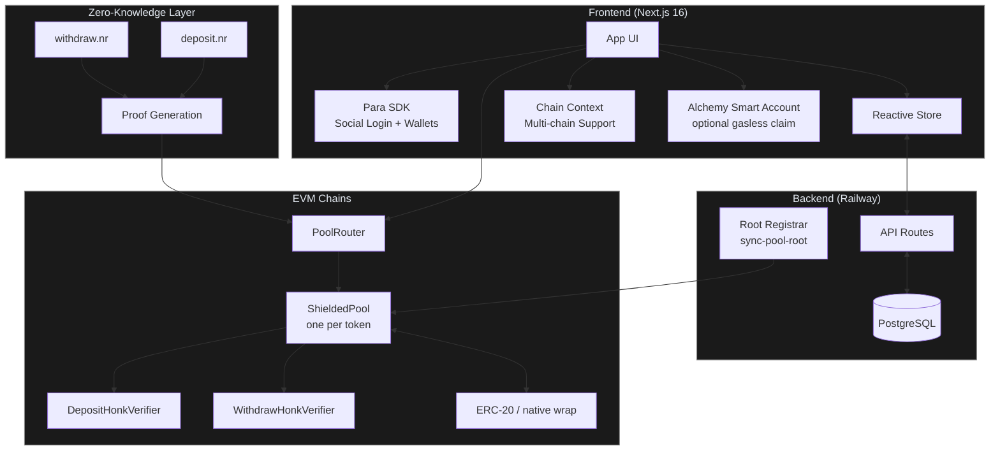

# Blizkperse

**Private stablecoin payments on any chain.**

Blizkperse is a chain-agnostic payout platform that uses Zero-Knowledge proofs to make on-chain payments confidential. Organizers deposit tokens into shielded pools via a `PoolRouter`; recipients claim them with ZK proofs so payment amounts stay hidden on-chain.

---

## How It Works

1. **Login**: Recipients sign in via Social Login (Para) and instantly get an Embedded Wallet.
2. **Subscribe**: Recipients subscribe to a Payer (Organizer/DAO), usually via invite link.
3. **Deposit**: Payers select subscribers, set arbitrary amounts of any supported token, generate a deposit ZK proof, and pay through the `PoolRouter` (note amount + protocol fee).
4. **Claim**: Recipients pick a destination address (connected wallet by default), generate a withdraw ZK proof, and claim. Sponsored claims (Alchemy AA) need no gas; moving funds later still needs gas token.
5. **Agents**: API-ready for AI Agents and x402 to trigger payouts autonomously.

---

## Architecture



**On-chain roles (separate keys recommended):**

| Role | Who | Responsibility |
| --- | --- | --- |
| **Owner** | Deployer `PRIVATE_KEY` | Router admin (`setPool`, `setFeeConfig`, …) |
| **Treasury** | `TREASURY_ADDRESS` | Receives protocol fee (`feeBps`, default 0.3%) |
| **Root registrar** | `ROOT_REGISTRAR_ADDRESS` + web `ROOT_REGISTRAR_PRIVATE_KEY` | Only wallet allowed to `registerRoot` on pools |

Canonical model: [`zk/docs/arbitrary-amounts-multitoken.md`](zk/docs/arbitrary-amounts-multitoken.md).

---

## Supported Chains

Addresses below are production defaults from [`web/lib/constants.ts`](web/lib/constants.ts) (Aug 2026 multi-pool redeploy). Override with `NEXT_PUBLIC_*` env vars.

### Mainnet — routers & verifiers

| Chain | ID | PoolRouter | DepositVerifier | WithdrawVerifier | HonkVerifier |
| --- | --- | --- | --- | --- | --- |
| **Monad** | 143 | [`0x6c1e…0C47`](https://monadexplorer.com/address/0x6c1e06C0b652A4F14bD6b4DC647C2BC94e970C47) | [`0x15A8…4c99`](https://monadexplorer.com/address/0x15A82F907e7B57f21909DB74816f8F96C4224c99) | [`0x302E…DB29`](https://monadexplorer.com/address/0x302E7a235f5BFdf2c947fDF827954607c700DB29) | [`0xAB7c…Fc69`](https://monadexplorer.com/address/0xAB7c795191d2e64138c86a610d26698B8da3Fc69) |
| **Celo** | 42220 | [`0x5aC1…405c`](https://celoscan.io/address/0x5aC1F6d71Dd91fcbEDEDeaB07cf07D5FaBCc405c) | [`0x15A8…4c99`](https://celoscan.io/address/0x15A82F907e7B57f21909DB74816f8F96C4224c99) | [`0xC54A…953F`](https://celoscan.io/address/0xC54A859c187fFAF1C1f9d5AE4a0E90f0Ad58953F) | [`0xd9C9…3b3C`](https://celoscan.io/address/0xd9C9bC4f84476feF018F47621531526823E13b3C) |
| **Robinhood** | 4663 | [`0xB3a0…fDc8`](https://robinhoodchain.blockscout.com/address/0xB3a0a715ffa799349ccc06F6e6169C96c97EfDc8) | [`0xAB7c…Fc69`](https://robinhoodchain.blockscout.com/address/0xAB7c795191d2e64138c86a610d26698B8da3Fc69) | [`0x80B7…22d2`](https://robinhoodchain.blockscout.com/address/0x80B7399669116f62Aa69B73aA06400EB648E22d2) | [`0x6c1e…0C47`](https://robinhoodchain.blockscout.com/address/0x6c1e06C0b652A4F14bD6b4DC647C2BC94e970C47) |

### Mainnet — pools (one per token)

| Chain | Tokens / pools |
| --- | --- |
| **Monad** | USDC `0x80B7…22d2` · USDT `0x49B3…223F` · WMON `0xE1e6…C7A8` |
| **Celo** | USDT (default) `0x2280…69CC` · USDC `0xd484…b475` · COPm `0xE0d3…0EB4` · CELO `0x1CF4…ceb9` |
| **Robinhood** | USDG (default) `0x481C…8A19` · USDe `0x1D95…7125` · WETH `0x7cEb…46E2` |

> **Celo:** do not use `depositNative` / `WRAPPED_NATIVE` — CELO is a normal ERC-20 pool. **Monad:** WMON uses `depositNative`.

### Testnet

Legacy single-pool USDC deploys remain in `constants.ts` under `BLIZ_ENV=development` (Monad 10143, Celo 11142220). Robinhood has no dedicated testnet deploy yet.

> Full addresses + deploy blocks: [`web/lib/constants.ts`](web/lib/constants.ts) and [ZK README](zk/README.md#deployed-contracts).

---

## Tech Stack

| Layer | Technology |
| --- | --- |
| **Blockchain** | EVM: Monad (143), Celo (42220), Robinhood Chain (4663) |
| **Contracts** | Foundry — `PoolRouter` + per-token `ShieldedPool` + deposit/withdraw Honk verifiers |
| **Frontend** | Next.js 16 (App Router, Webpack) + Tailwind CSS v4 |
| **Auth** | Para SDK for Social Login + Embedded Wallets |
| **Gasless claim** | Alchemy Account Kit / Gas Manager (optional) |
| **UI** | shadcn/ui (new-york style, Radix primitives) |
| **Database** | PostgreSQL (Railway) |
| **Payments** | Arbitrary ERC-20 amounts (and wrapped native where configured) |
| **Theming** | Chain-adaptive; neutral default until a network is selected |

---

## Project Structure

```text
blizkperse/
├── docs/                           # Architecture, integration, brand docs
│   ├── technical_spec.md
│   ├── integration_guide.md
│   └── brand_kit.md
│
├── landing/                        # Marketing site (blizkperse.com)
│
├── sql/
│   └── schema.sql
│
├── web/                            # App (app.blizkperse.com)
│   ├── app/
│   │   ├── api/
│   │   │   ├── data/               # Hydration (+ payout claimed backfill)
│   │   │   ├── deposit-events/
│   │   │   ├── generate-deposit-proof/
│   │   │   ├── generate-proof/     # Withdraw proof
│   │   │   ├── notes/
│   │   │   ├── payments/[id]/claim
│   │   │   ├── payments/reconcile
│   │   │   ├── sync-pool-root/     # Registrar-only Merkle tip sync
│   │   │   └── …
│   │   ├── payer/                  # Distribute dashboard + create payout
│   │   ├── receive/                # Receive dashboard + claim (destination tip)
│   │   └── terms/
│   ├── components/
│   │   ├── claim-destination-tip.tsx
│   │   └── …
│   └── lib/
│       ├── constants.ts            # Chain registry (source of truth)
│       ├── contracts.ts
│       ├── payout-status.ts        # Client-safe status helpers
│       ├── payout-status-db.ts     # Server SQL sync (do not import from client)
│       └── …
│
├── zk/
│   ├── circuits/src/
│   │   ├── deposit.nr
│   │   ├── withdraw.nr / main.nr
│   │   └── pay.nr
│   ├── contract/
│   │   ├── PoolRouter.sol
│   │   ├── ShieldedPool.sol
│   │   ├── DepositVerifier.sol
│   │   └── WithdrawVerifier.sol
│   ├── docs/
│   │   ├── arbitrary-amounts-multitoken.md   # Current on-chain model
│   │   ├── build-and-deploy.md
│   │   └── …
│   └── script/
│       ├── Deploy.s.sol            # DeployMultiPool, …
│       ├── DeployDepositVerifier.s.sol
│       └── AddPool.s.sol           # Add one pool to an existing router
│
├── Dockerfile / Dockerfile.landing
├── railway.toml
└── README.md
```

---

## Getting Started

### Prerequisites

- Node.js 20+
- [Foundry](https://book.getfoundry.sh) (`forge`, `cast`, `anvil`)
- [Nargo](https://noir-lang.org/docs/getting_started/noir_installation) (Noir compiler)
- [Barretenberg](https://github.com/AztecProtocol/aztec-packages/tree/master/barretenberg/bbup) (`bb` CLI)
- PostgreSQL (local or Railway)

### Quick Start

```bash
# 1. Landing page (static marketing site)
cd landing && npm install && npm run dev -- -p 3002
```

Open [http://localhost:3002](http://localhost:3002).

```bash
# 2. Install contract dependencies
cd ../zk && forge install

# 3. Install app frontend
cd ../web && npm install

# 4. Configure environment
cp .env.example .env.local
# Fill in NEXT_PUBLIC_PARA_API_KEY, DATABASE_URL, router/pool addresses,
# ROOT_REGISTRAR_PRIVATE_KEY, and optional Alchemy AA vars

# 5. Start app (--webpack required for WASM)
npm run dev -- --webpack
```

Open [http://localhost:3000](http://localhost:3000).

### Deploy to Railway

**Landing** (`blizkperse.com`):

1. Railway service → **Root Directory: `landing`** (uses `landing/Dockerfile` + `landing/railway.toml`)
2. Set `NEXT_PUBLIC_APP_URL=https://app.blizkperse.com` (build-time)
3. Watch path: `/landing/**`
4. Do **not** use the repo-root `Dockerfile` — that image installs Noir/bb for the app and will fail or OOM on the landing service

**App** (`app.blizkperse.com`):

1. Deploy from GitHub + PostgreSQL (`DATABASE_URL`)
2. Set build-time `NEXT_PUBLIC_*` (Para, chains, routers/pools, Alchemy, fee bps)
3. Set runtime secrets: `ROOT_REGISTRAR_PRIVATE_KEY`, DB, etc.
4. Watch path: `/web/**`
5. Build uses `--webpack` (see `Dockerfile`)

---

## Documentation

### Architecture & Frontend

| File | Description |
| --- | --- |
| [`docs/technical_spec.md`](docs/technical_spec.md) | Architecture, contracts, DB, payout status rules, deployment |
| [`docs/integration_guide.md`](docs/integration_guide.md) | Frontend ↔ ZK ↔ Router wiring |
| [`web/README.md`](web/README.md) | App setup, env vars, structure |
| [`sql/schema.sql`](sql/schema.sql) | PostgreSQL schema |

### ZK Circuits & Contracts

| File | Description |
| --- | --- |
| [`zk/docs/arbitrary-amounts-multitoken.md`](zk/docs/arbitrary-amounts-multitoken.md) | **Current** PoolRouter / multi-token / fee / registrar model |
| [`zk/README.md`](zk/README.md) | Noir + Foundry setup, deploy scripts, addresses |
| [`zk/docs/build-and-deploy.md`](zk/docs/build-and-deploy.md) | Verifier compilation checklist |
| [`zk/docs/demo-deposit-withdraw.md`](zk/docs/demo-deposit-withdraw.md) | CLI demo (may describe legacy single-pool flow) |
| [`zk/docs/test-deposit-withdraw.md`](zk/docs/test-deposit-withdraw.md) | On-chain testing notes |
| [`zk/docs/testnet-deploy.md`](zk/docs/testnet-deploy.md) | Testnet notes |

### Brand & Design

| File | Description |
| --- | --- |
| [`docs/brand_kit.md`](docs/brand_kit.md) | Color palette, typography, chain-adaptive theming |

---

## Team

- [**0xj4an**](https://github.com/0xj4an) - Dev Lead, Frontend, Product
- [**ArturVargas**](https://github.com/ArturVargas) - ZK Circuits, Contracts, Deploy Scripts
